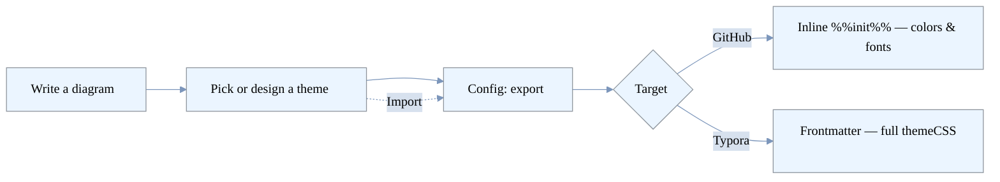

<a name="readme-top"></a>

<div align="center">


[](LICENSE)
[](https://reactjs.org/)
[](https://mermaid.js.org/)
[](https://github.com/johnzastrow/modern_mermaid/pkgs/container/modern_mermaid)

**A self-hosted Mermaid.js editor for designing diagram themes and exporting reusable style configs for your Markdown docs.**

</div>

---

Modern Mermaid is a browser-based Mermaid editor you run yourself. Beyond live editing and image export, it is built to **author diagram themes visually and export them as paste-ready config** you can drop into any Markdown file — so every diagram across your docs shares one consistent, on-brand look.

> **About this fork.** This is a self-hosted, privacy-respecting fork of
> [gotoailab/modern_mermaid](https://github.com/gotoailab/modern_mermaid): analytics
> and telemetry removed, dependencies modernized, hardened for container
> deployment, and extended with a full **theme export → edit → import** workflow.


---

## ✨ Highlights

### 🎨 Export themes to Markdown
Turn any theme into a paste-ready snippet for a ` ```mermaid ` block:
- **Inline `%%{init}%%`** — colors + fonts (`themeVariables`). Works in every renderer, **including GitHub**.
- **YAML frontmatter** — full `themeCSS` styling (rounded corners, per-element rules). Renders richly in **Typora** and other complete Mermaid renderers; GitHub degrades gracefully to colors/fonts.

### 🖌️ Visual theme editor
Design a theme with **rich controls** — per-variable color pickers, a **font picker with live previews**, a **corner-radius** slider, a dark-mode toggle, and an advanced `themeCSS` editor with a reload button. Everything previews in real time.

### 💾 Saved theme library
Start **from scratch** or from a preset, tweak, **name and save** to your browser, and reuse it anytime from the theme menu. Stock presets are never modified — customizing always makes a new copy.

### 📥 Import & round-trip
Paste an exported `%%{init}%%` directive, YAML frontmatter, or a JSON config back in to reconstruct an **editable** theme. Imported `themeCSS` is sanitized (no `@import`, external `url()`, `expression()`, or executable URL schemes).

### 🐳 Self-hosted & hardened
Ships as a **non-root** container with a strict Content-Security-Policy, published to the GitHub Container Registry. No backend, no accounts, **no telemetry**.

### 🧩 Plus the essentials
24 built-in themes, multi-language UI, live preview with zoom/pan/fullscreen, image export (PNG/JPG), and annotation tools.

---

## 🧭 The theme workflow



1. **Design** — click **Customize** (or **New**) and edit colors, font, radius, and CSS with live preview.
2. **Save** — name it and **Save** to your library.
3. **Export** — click **Config**, copy the **frontmatter** (Typora, full styling) or the **inline `%%{init}%%`** (GitHub, colors/fonts) snippet, and paste it atop your diagram.
4. **Round-trip** — later, **Import** that snippet back to keep editing.

---

## 🚀 Quick Start

### Prerequisites
- Node.js 20.19+ or 22.12+
- [pnpm](https://pnpm.io/) (via Corepack: `corepack enable`)

### Installation

```bash
git clone https://github.com/johnzastrow/modern_mermaid.git
cd modern_mermaid
pnpm install
```

### Development

```bash
pnpm dev        # http://localhost:5173
```

### Build

```bash
pnpm build      # production build to dist/
pnpm preview    # preview the build
pnpm lint       # ESLint
pnpm test       # Vitest
```

---

## 🐳 Self-Hosting (Docker)

The app ships as a hardened static site: a multi-stage build served by a
**non-root** `nginx-unprivileged` container on port **8080**, with a strict
Content-Security-Policy and security headers. It has no backend and needs no
configuration.

### Option A — pull the prebuilt image (recommended)

Every push to `main` publishes an image to the GitHub Container Registry, so a
server just needs to pull and run it:

```bash
docker run -d --name modern-mermaid -p 8080:8080 --restart unless-stopped \
  ghcr.io/johnzastrow/modern_mermaid:latest
```

Or, with Compose (`docker-compose.deploy.yml` is in the repo):

```yaml
# docker-compose.deploy.yml
services:
  modern-mermaid:
    image: ghcr.io/johnzastrow/modern_mermaid:latest
    container_name: modern-mermaid
    ports:
      - "8080:8080"
    restart: unless-stopped
    pull_policy: always
    security_opt:
      - no-new-privileges:true
    cap_drop:
      - ALL
    healthcheck:
      test: ["CMD", "wget", "-qO-", "http://127.0.0.1:8080/"]
      interval: 30s
      timeout: 3s
      retries: 3
```

```bash
docker compose -f docker-compose.deploy.yml up -d
```

Then browse to `http://<host>:8080`. To update: `docker compose -f docker-compose.deploy.yml pull && docker compose -f docker-compose.deploy.yml up -d`.

> The GHCR package inherits the repository's visibility. For a public repo it is
> pullable without auth; for a private repo run `docker login ghcr.io` first.

### Option B — build from source

`docker-compose.yml` builds the image locally from the `Dockerfile`:

```bash
docker compose up -d --build
```

Put it behind your existing reverse proxy (Caddy/Traefik/nginx) for TLS; the
container serves plain HTTP on 8080 by design.

---

## 🛠️ Tech Stack

| Technology | Version | Purpose |
|------------|---------|---------|
| **React** | 19 | UI framework |
| **TypeScript** | 6 | Type safety |
| **Vite** | 8 | Build tool |
| **Tailwind CSS** | 4 | Styling |
| **Mermaid.js** | 11.16 | Diagram rendering |
| **Lucide React** | 1 | Icons |
| **Vitest** | 4 | Tests |
| **pnpm** | 11 | Package manager (Corepack) |

CI runs lint, tests, `pnpm audit`, a container build, and CodeQL on every PR; Dependabot keeps dependencies current. See [`SECURITY.md`](SECURITY.md).

---

## 📖 Usage

1. **Write** Mermaid code in the left editor; it renders live on the right.
2. **Theme** it from the toolbar — pick a preset, **Customize**, or start a **New** theme.
3. **Config** — export the active theme as an `%%{init}%%` / frontmatter snippet for your docs.
4. **Import** — paste a snippet back to reconstruct an editable theme.
5. **Export image** — download or copy as PNG/JPG when you need a picture instead.

### Keyboard Shortcuts

| Shortcut | Action |
|----------|--------|
| `Ctrl/Cmd + S` | Download diagram |
| `Ctrl/Cmd + C` | Copy to clipboard |
| `Esc` | Exit fullscreen |

More diagram examples live in [`src/utils/examples.ts`](src/utils/examples.ts).

---

## 🎨 Theme gallery

<table>
  <tr>
    <td width="33%"><br/><b>Brutalist</b></td>
    <td width="33%"><br/><b>Cyberpunk</b></td>
    <td width="33%"><br/><b>Ghibli</b></td>
  </tr>
  <tr>
    <td><br/><b>Memphis</b></td>
    <td><br/><b>Spotless</b></td>
    <td><br/><b>Hand Drawn</b></td>
  </tr>
</table>

---

## 🤝 Contributing

Issues and pull requests are welcome.

1. Fork the repo and branch from `main` (`git checkout -b feat/thing`).
2. Run `pnpm lint` and `pnpm test` before committing.
3. Open a PR — CI (lint, test, audit, container build, CodeQL) must pass.

---

## 📄 License

MIT — see [LICENSE](LICENSE). Forked from
[gotoailab/modern_mermaid](https://github.com/gotoailab/modern_mermaid) (MIT);
this fork's changes are documented in [CHANGELOG.md](CHANGELOG.md).

## 🙏 Acknowledgments

- [Mermaid.js](https://mermaid.js.org/), [React](https://reactjs.org/), [Vite](https://vitejs.dev/), and [Tailwind CSS](https://tailwindcss.com/)
- The upstream [gotoailab/modern_mermaid](https://github.com/gotoailab/modern_mermaid) project and its contributors

<p align="right">(<a href="#readme-top">back to top</a>)</p>
